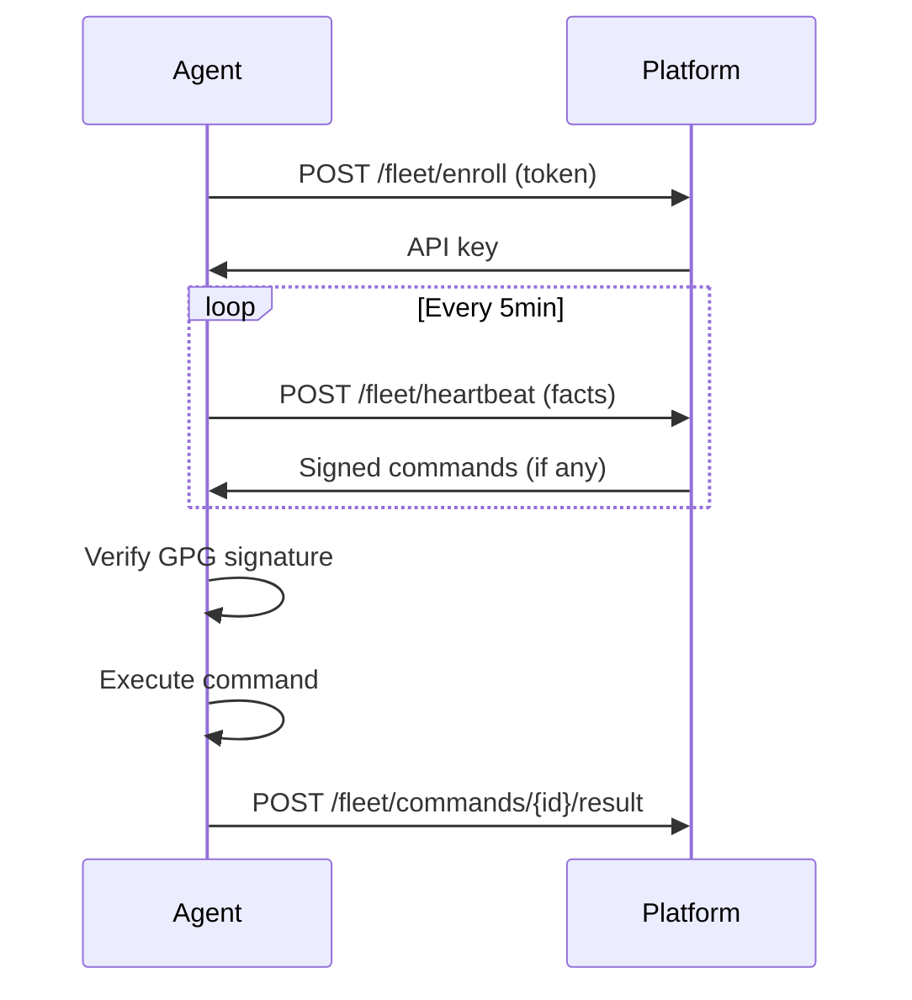

# Fleet Monitoring Runbook

Shanios ships no fleet dashboard by design — no central console, no MDM server, no agent phoning home. Observability is composed from standard pieces you already run: Prometheus for metrics, Grafana for views, your log store of choice for journals. The only Shanios-specific inputs are a handful of on-host signals (`shani-health`, slot markers) exposed through standard mechanisms, and nothing Shanios-specific runs centrally.

---

## Per-Host Metrics

Run `node_exporter` as a rootless Podman container via quadlet, with the standard read-only host binds:

```ini
# ~/.config/containers/systemd/node_exporter.container
[Container]
Image=docker.io/prom/node-exporter:v1.9.1
Exec=--path.procfs=/host/proc --path.sysfs=/host/sys --path.rootfs=/host/root \
     --collector.textfile.directory=/textfile
Volume=/proc:/host/proc:ro,rprivate,rbind
Volume=/sys:/host/sys:ro,rprivate,rbind
Volume=/:/host/root:ro,rprivate,rbind
Volume=%h/exporters/textfile:/textfile:ro,Z
PublishPort=9100:9100
[Service]
Restart=on-failure
```

Enable with `mkdir -p ~/exporters/textfile && systemctl --user daemon-reload && systemctl --user start node_exporter.service`. firewalld is default-deny inbound, so open 9100 to the scraper subnet only:

```bash
sudo firewall-cmd --permanent --add-rich-rule='rule family=ipv4 source address=10.10.0.0/24 port port=9100 protocol=tcp accept' && sudo firewall-cmd --reload
```

Scrape from a self-hosted Prometheus (deployment patterns in [Monitoring & Observability](../servers/monitoring/prometheus.md)):

```yaml
scrape_configs:
  - job_name: shanios-fleet
    static_configs:
      - targets: ['host-a.tailnet.ts.net:9100', 'host-b.tailnet.ts.net:9100']
```

---

## Deploy-State Signals

Two cron jobs (cronie is enabled by default on the server profile) turn Shanios state into textfile-collector metrics:

```crontab
*/5 * * * * root /usr/local/sbin/shani-textfile-metrics
0 4 * * *  root shani-health --verify --json > /var/local/shani-health.json
```

`--verify` includes a full Btrfs scrub so it runs nightly; cheap state refreshes every five minutes. `/var/local/shani-health.json` is persistent local state, fine to keep per host and worth shipping off-box as compliance evidence (see [Compliance & Benchmarks](compliance)). The metrics script writes atomically (`mv`), so node_exporter only ever reads complete files:

```bash
#!/bin/bash
# /usr/local/sbin/shani-textfile-metrics — feed the node_exporter textfile collector
set -euo pipefail
OUT=/var/local/node_exporter; mkdir -p "$OUT"
TMP=$(mktemp "$OUT/.shani.XXXXXX")

# Integrity result from last night's verify (missing file counts as fail)
if jq -e 'any(.checks[]?; .status == "fail")' /var/local/shani-health.json >/dev/null 2>&1; then V=0; else V=1; fi
echo "shani_verify_success $V" >> "$TMP"

# Age of last verify, so a silently dead job also alarms
echo "shani_verify_last_run_seconds $(stat -c %Y /var/local/shani-health.json 2>/dev/null || echo 0)" >> "$TMP"

# Pending-reboot marker (tmpfs; cleared at boot). mtime = when update was staged
P=$([ -f /run/shanios/reboot-needed ] && echo 1 || echo 0)
echo "shani_reboot_pending $P" >> "$TMP"
[ "$P" = 1 ] && echo "shani_reboot_pending_mtime $(stat -c %Y /run/shanios/reboot-needed)" >> "$TMP"

echo "shani_failed_units $(systemctl --failed --no-legend | wc -l)" >> "$TMP"

chmod 644 "$TMP"; mv "$TMP" "$OUT/shani_state.prom"
```

### Alert-worthy conditions

| Condition | Signal |
|---|---|
| Nightly verify failed or silently dead | `shani_verify_success == 0`; staleness via `time() - shani_verify_last_run_seconds > 2 days` |
| Host drifted from its channel | installed version differs from the channel manifest (`latest.txt`/`stable.txt` under the CDN base URL) beyond N days |
| Update staged but never rebooted | `/run/shanios/reboot-needed` present longer than your maintenance-window SLA |
| Failed units accumulating | `shani_failed_units > 0` sustained |
| Boot failure markers | `/data/boot_failure` or `/data/boot_hard_failure` present |

Channel-drift and boot-marker checks are small additions to the script following the identical pattern (fetch the manifest with `curl`, compare against `.VERSION_ID` in `/usr/lib/os-release`; test marker files with `[ -f ]`).

---

## Log Shipping

Local journal retention is deliberately small (128 MB x 2 files), so ship promptly if you need history.

**Pattern A — stream JSON journal into a log shipper:**

```bash
journalctl -f -o json | podman run --rm -i \
  -v ~/exporters/vector.toml:/etc/vector/vector.toml:ro,Z \
  docker.io/timberio/vector:latest-alpine --config /etc/vector/vector.toml
```

The Vector config is a `stdin` source plus whatever sink you run (Loki, Elasticsearch, S3 archive); wrap the pipeline in a user systemd unit so it restarts and starts at boot.

**Pattern B — rsyslog-in-container:** bind-mount `/run/systemd/journal/syslog` into an rsyslog container, set `ForwardToSyslog=yes` via a journald drop-in, and forward centrally from there. Journald persistence and drop-in mechanics are covered in [System Logging](../system/logging.md).

---

## Grafana Dashboard Sketch

Suggested panels for a per-fleet view:

| Panel | Source |
|---|---|
| Active-slot age (days) | `time() - shani_slot_booted_since` (textfile extension of the script above) |
| Verify result gauge | `sum(shani_verify_success)` vs `count(shani_verify_success)` |
| Updates pending / channel drift | `max by (instance) (shani_channel_drift)` (custom metric, pattern above) |
| Pending reboots and age | `sum(shani_reboot_pending)` ; `time() - shani_reboot_pending_mtime` |
| Bees dedup ratio | `shani_bees_dedup_ratio` (textfile extension) |
| ZRAM/swap usage | `node_memory_SwapTotal_bytes - node_memory_SwapFree_bytes` (zram is the swap device) |
| Scrub last run | `time() - shani_scrub_last_run` (textfile extension) |

---

## Alert Rules

```yaml
groups:
  - name: shanios-integrity
    rules:
      - alert: ShaniVerifyFailed
        expr: shani_verify_success == 0
        for: 15m
        labels: { severity: critical }
        annotations: { summary: "Integrity verify failed on {{ $labels.instance }}" }
      - alert: ShaniRebootPendingTooLong
        expr: shani_reboot_pending == 1 and (time() - shani_reboot_pending_mtime) > 604800
        for: 12h
        labels: { severity: warning }
        annotations: { summary: "Update staged over a week ago, never rebooted: {{ $labels.instance }}" }
      - alert: ShaniRootFilesystemLow
        expr: node_filesystem_avail_bytes{mountpoint="/"} / node_filesystem_size_bytes{mountpoint="/"} < 0.15
        for: 30m
        labels: { severity: warning }
        annotations: { summary: "Root pool below 15% free: {{ $labels.instance }}" }
```

---

## Rollout Checklist

1. Start with **2–3 canary hosts** running the full stack (node_exporter + cron + textfile + log shipper), kept on `latest` while the rest of the fleet stays on `stable`.
2. Watch one full weekly update cycle before widening; stagger any `shani-deploy --set-channel` changes across days rather than flipping groups simultaneously.
3. Drive reboots from your maintenance window off the `/run/shanios/reboot-needed` marker (see [OEM & Fleet Deployment](fleet)).
4. Validate alert paths deliberately — stage an update on one VM and let the pending-reboot alert fire; force a channel mismatch and confirm drift detection — then roll out fleet-wide in batches.

---

## Fleet Agent Enrollment

The `shani-fleet` agent enrolls machines with `shani-platform` using a pull-based model:

1. **Enrollment token** — IT generates a token from the platform UI
2. **Agent enrollment** — Agent calls `POST /fleet/enroll` with the token
3. **Heartbeat** — Agent sends facts every 5 minutes via `POST /fleet/heartbeat` (default `HEARTBEAT_INTERVAL=300`; driven by the `shani-fleet-agent.timer` systemd timer)
4. **Command delivery** — Platform piggybacks commands on heartbeat responses
5. **Command execution** — Agent verifies GPG signature, executes, posts result



## Signed Command Trust Chain

Every command delivered to fleet agents is GPG-signed by the platform. The agent verifies the signature before execution — this is the security boundary of the entire fleet (arbitrary remote exec is gated entirely on this check).

```
Platform signs command → Agent verifies signature → Agent executes
```

If signature verification fails, the agent refuses to execute and reports the failure.

## Monitoring Fleet Health

The platform derives alerts from heartbeat data:

| Alert | Condition | Severity |
|-------|-----------|----------|
| Offline | No heartbeat > 15 minutes (default `SHANI_FLEET_ONLINE_WINDOW=900`) | Warning |
| Verify failed | OS integrity check failed | Critical |
| Clock skew | Clock drift > 5 minutes | Warning |
| Reboot stuck | Reboot pending > 7 days | Warning |
| Channel drift | Machine on unexpected channel | Info |

## See Also

- [OEM & Fleet Deployment](fleet) — channels, update flow, reboot markers
- [shani-health Reference](../updates/shani-health.md) — `--verify --json`, exit codes
- [Monitoring & Observability](../servers/monitoring/prometheus.md) — self-hosted Prometheus/Grafana/Loki stacks
- [cronie](../system/cronie.md) — scheduler syntax and system crontabs
