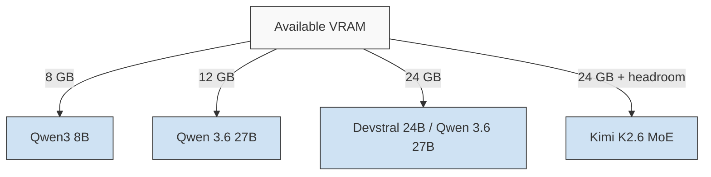

# AI-Assisted Development

Shanios supports every major style of AI-assisted coding: cloud assistants (GitHub Copilot, Anthropic, OpenAI-backed tools), editor extensions (Continue, Cody, Cline), agentic terminal harnesses (OpenCode, Claude Code, aider, Gemini CLI, Codex CLI), and fully local models that never send your code anywhere. The immutable base stays untouched either way — all tooling lives in Flatpak, Nix, containers, or your home directory.

## Choosing an Approach

| Style | Examples | Your code leaves the machine | Needs GPU |
|---|---|---|---|
| Cloud assistant extension | Copilot, Cody, Continue (API mode), Cline | Yes — snippets sent to vendor | No |
| Agentic CLI / harness | OpenCode, Claude Code, aider, Gemini CLI, Codex CLI, Goose | Depends on configured provider/model | No |
| Local model + editor bridge | Continue/Ollama, Tabby, Cline (local mode) | No | Helpful (AMD/Intel iGPU works; NVIDIA best) |
| Fully local agentic CLI | OpenCode/aider pointed at Ollama or a local DeepSeek | No | Same as above |

## Cloud Assistants in Editors

VS Code installs as a Flatpak (`org.visualstudio.code`); JetBrains IDEs via Flathub. Extensions install inside the editor sandbox exactly as upstream documents them:

```bash
flatpak install flathub org.visualstudio.code
flatpak install flathub com.vscodium.codium   # telemetry-free alternative
```

- **GitHub Copilot** — sign in via the extension; authentication and completions work inside the Flatpak sandbox with no extra configuration.
- **Continue / Cody** — configure either for cloud APIs or point them at a local endpoint (below).
- API keys live in `~/.config` / `~/.var/app/<app>/config` under `@home` — they persist across updates and rollbacks.

Agentic CLIs that expect Node.js run cleanly inside a Distrobox container or via Nix:

```bash
# Distrobox route: full node environment, home shared
distrobox create --name dev --image archlinux:latest
distrobox enter dev
npm install -g @anthropic-ai/claude-code   # or: pip install aider-chat

# Nix route: single binaries in your profile
nix-env -iA nixpkgs.aider
```

## Agentic CLIs & Harnesses

Terminal-native coding agents (harnesses) drive whole tasks — editing files, running commands, iterating on failures. In 2026 they are the fastest-growing category of dev tooling. They are ordinary userland binaries, so they install into `~/.local/bin` (under `@home`, survives updates) or inside Distrobox without touching the immutable root:

| Harness | Install on Shanios | Provider flexibility |
|---|---|---|
| **OpenCode** | `curl -fsSL https://opencode.ai/install \| bash` (lands in `~/.local/bin`) or `npm i -g opencode-ai` in Distrobox | Most flexible — 75+ providers via Models.dev, plus local models through Ollama-compatible endpoints |
| **Claude Code** | `npm install -g @anthropic-ai/claude-code` (Distrobox/nvm) | Anthropic API; point `ANTHROPIC_BASE_URL` at compatible endpoints for other backends |
| **Codex CLI** | `npm i -g @openai/codex` (Distrobox/nvm) | OpenAI-first; custom providers (DeepSeek, Qwen, Kimi) via `~/.codex/config.toml` with `wire_api = "chat"` |
| **Gemini CLI** | `npm install -g @google/gemini-cli` (Distrobox/nvm) | Google API / OAuth free tier; Plan Mode for long-horizon tasks |
| **aider** | `nix-env -iA nixpkgs.aider` or `pip install aider-chat` (pipx/venv in home) | Git-native — auto-commits every change for reviewable history; any OpenAI-compatible endpoint |
| **Goose** | Binary from [block/goose releases](https://github.com/block/goose/releases) into `~/.local/bin` | Multi-provider including local Ollama |
| **GitHub Copilot CLI** | `gh extension install github/gh-copilot` | GitHub-native workflows |

A useful rule of thumb the ecosystem has converged on: **the harness shapes workflow; the model decides quality.** All of the above run happily on budget backends, so pick the tool whose ergonomics fit you and route it to whatever provider suits your budget and privacy needs.

### Wiring a Harness to Any Provider

Every harness consumes OpenAI-compatible endpoints, which makes providers interchangeable. Worked example with DeepSeek — the identical two-line swap works for OpenAI, Gemini, GLM, Kimi, Qwen, or a self-hosted endpoint:

```bash
# Hosted provider example (DeepSeek shown; same shape for any compatible API)
export OPENAI_API_BASE=https://api.deepseek.com
export OPENAI_API_KEY=sk-...

# Or skip hosted entirely — local weights via Ollama
podman exec ollama ollama pull deepseek-r1:8b        # reasoning-style distill
podman exec ollama ollama pull deepseek-coder-v2:16b # coding-focused variant
podman exec ollama ollama pull qwen2.5-coder:7b      # alternative coding family
aider --model ollama/deepseek-coder-v2:16b
```

Budget-hosted APIs keep per-session costs to cents; local distills trade some capability for zero data egress. Nothing here is exclusive — the same machine can mix hosted providers for heavy tasks and local models for proprietary code, and switching providers is a two-line change because the harness layer does not care.

## Free & Low-Cost Model Access

You can run a full agentic workflow in 2026 without paying for inference. Three routes, each with different trade-offs.

### OpenCode Zen

Zen is OpenCode's curated model gateway (`https://opencode.ai/zen/v1`, OpenAI-compatible). Beyond pay-per-use frontier models under one key, it exposes **rotating free models** — typically community and vendor-promo coding models (names rotate; check the picker or `curl https://opencode.ai/zen/v1/models`). Filter for `free` in the model switcher and use them with no key of your own.

> **Privacy caveat that matters:** several Zen free-period models state that collected data may be used for model improvement. Fine for boilerplate and public code; avoid proprietary paths on those specific models.

### Permanent Free Tiers (no credit card)

| Provider | What you get | The catch |
|---|---|---|
| **Google AI Studio** (Gemini Flash) | Large daily request quota, 1M-token context, multimodal | Prompts may train models outside EU/UK; quotas cut before, verify current limits |
| **Groq** | Extremely fast inference on open models (Llama 70B class, GPT-OSS) | Rate-limited (RPM/daily caps); smaller context windows |
| **Cerebras** | High daily token volume (~1M tokens/day) on open models | Context length capped on free tier |
| **NVIDIA NIM** (build.nvidia.com) | 100+ hosted open models against free build credits | Trial-oriented; session logging on some endpoints |
| **Mistral La Plateforme** ("Experiment") | Massive monthly token budget incl. Codestral for code | Requires opting into data training |
| **OpenRouter `:free` models** | 30+ free variants behind ONE key, easy model swapping | Daily request cap tied to lifetime credit (~50/day below $10 top-up, ~1000/day at ≥$10) |
| **GitHub Models** | Frontier-class models via Azure endpoint + playground, GitHub account only | Rate-limited; evaluation use |
| **Cloudflare Workers AI** | Free daily allocation across many small models | Smaller models; edge-oriented |

All speak the OpenAI dialect, so any harness or editor bridge on this page consumes them directly:

```bash
# Example: route aider through Groq
export OPENAI_API_BASE=https://api.groq.com/openai/v1
export OPENAI_API_KEY=gsk_...
aider --model openai/llama-3.3-70b-versatile
```

### Stacking Tiers

Because each provider's limits are independent, common practice is stacking several free keys behind a router — [OpenRouter](https://openrouter.ai) (one key + failover, ~5% fee on paid usage), or self-hosted [LiteLLM](https://github.com/BerriAI/litellm) proxy in Podman if you want full control:

```bash
podman run -d --name litellm -p 4000:4000 \
  -v ~/.litellm/config.yaml:/app/config.yaml \
  ghcr.io/berriai/litellm:main --config /app/config.yaml
```

Point any harness at `http://localhost:4000/v1` and it fails across free tiers automatically.

> **Honest expectations:** free tiers change monthly, throttle mid-task, and never include frontier weights. They excel at boilerplate, tests, and learning; for hard multi-file refactors, metered paid inference remains the rational upgrade — the harnesses themselves stay free either way.

## MCP: Wiring Agents into Tools

The Model Context Protocol is the standard way AI clients call external tools — adopted by Anthropic, OpenAI, Google, and Microsoft, and governed under the Linux Foundation since late 2025. If a harness supports MCP (Claude Code, OpenCode, Codex CLI, Gemini CLI, Cline, and most editors do), one server config unlocks integrations everywhere.

Developer-relevant first-party servers worth starting with:

| Server | What your agent gains |
|---|---|
| **GitHub** (`github/github-mcp-server`) | Issues, PRs, code search without leaving the agent loop |
| **Context7** (`upstash/context7`) | Up-to-date library docs injected at prompt time — cuts stale-API hallucinations |
| **Filesystem / Git** (reference servers) | Scoped repo access for non-repo-aware tools |
| **Playwright / Puppeteer** | Browser automation for testing web changes |
| **Postgres** | Read-only schema/data inspection during feature work |

Local stdio servers are plain processes configured in your client's config — state lives in `$HOME`, so configs survive updates like everything else:

```json
{
  "mcpServers": {
    "context7": { "command": "npx", "args": ["-y", "@upstash/context7-mcp"] }
  }
}
```

Security posture (the ecosystem's known weak spot): prefer first-party servers over registry finds, pin versions, scope credentials tightly, and treat random community servers with the same trust you would a curl-piped shell script. Prefer OAuth-backed remote (Streamable HTTP) servers for anything touching production systems.

## Repo Instructions: AGENTS.md

The [AGENTS.md](https://agents.md) format is the open standard for telling coding agents about your project — build commands, conventions, testing rules, no-go zones. It is governed under the Linux Foundation's Agentic AI Foundation, adopted by 60k+ repositories, and read natively by every major harness (Claude Code, Codex CLI, OpenCode, Cursor, Copilot). One file serves them all.

A minimal `AGENTS.md` at the repo root:

```markdown
# Project Notes

## Build & Test
- `make build` — compile
- `make check` — lint + unit tests; must pass before any commit

## Conventions
- Shell scripts follow existing style; `bash -n` before committing
- Never edit files under keys/ — signed material only changes via release process
- Docs live in docs/; regenerate manifests after edits

## No-gos
- Do not modify GPG keyring files without maintainer approval
```

Keep it short and factual — agents re-read it every session, so bloat costs tokens and compliance. Vendor-specific extras (`CLAUDE.md`, `.cursorrules`) still work alongside it when you need tool-specific hints.

## Spec-Driven Development

The 2026 methodology shift: instead of prompting an agent and hoping ("vibe coding"), write the specification first and let agents implement against it. GitHub's [Spec Kit](https://github.com/github/spec-kit) (Specify CLI: `/specify` → `/plan` → `/tasks` → `/implement`) and AWS's Kiro IDE formalize the loop, but the core practice needs nothing beyond Markdown discipline:

```text
.specs/
├── requirements.md   # user stories + acceptance criteria (no architecture)
├── design.md         # stack decisions, constraints, trade-offs
└── tasks.md          # numbered ~2-hour tasks, test-first, agent-sized
```

The numbered task list matters most: an agent told "implement task 3: add the webhook deliveries migration" makes far better choices than one told "build the feature". Works identically across every harness listed above.

## Async Cloud Agents

Beyond terminal harnesses running locally, 2026's other model is delegation: assign a task, an isolated cloud VM does the work, a draft PR comes back. These complement — not replace — local tools: delegate routine tickets while your desktop handles design work.

| Service | Trigger | Returns |
|---|---|---|
| **GitHub Copilot coding agent** | Assign an issue / `@copilot` | Draft PR on its own branch |
| **Google Jules** | Web UI / `jules` issue label (free tier: limited daily tasks) | Plan → approval → PR |
| **OpenAI Codex cloud** | chatgpt.com/codex prompt or `@codex` | Diff/PR from sandboxed VM |
| **Cursor cloud agents** | Editor/mobile/ticket | PR plus run recording |

Review discipline applies to all of them: read the diff, not the summary; never let an agent merge its own code; scope tasks tightly. On Shanios nothing special is required to consume their output — they open ordinary PRs against your hosted repos, which you then review and pull as usual.

## AI Code Review

Beyond generation, 2026's other big trend is automated review. Three integration styles:

- **SaaS reviewers** — CodeRabbit, Qodo, Greptile, Sourcery: connect your repo host, get AI summaries and line-level review comments on every PR. Nothing to install locally.
- **Self-hosted reviewer** — [PR-Agent](https://github.com/qodo-ai/pr-agent) (open source, from Qodo) runs as a container and reviews PRs on demand or via webhook:

  ```bash
  podman run --rm \
    -e OPENAI_KEY=$OPENAI_API_KEY \
    -e CONFIG.GIT_PROVIDER=github \
    docker.io/codiumai/pr-agent:latest \
    --pr_url=https://github.com/you/repo/pull/123 review
  ```

- **In-loop review** — ask your existing harness: `opencode "review my uncommitted diff for race conditions"` works today with zero extra setup, and pairs naturally with the Btrfs snapshot safety net before letting an agent touch anything.

## Local Models with Ollama

The [AI & LLMs](../servers/ai-llms.md) page documents full self-hosted inference stacks. For a developer workstation, the short path is the Ollama container with your GPU passed through:

```bash
# AMD / Intel GPUs: device passthrough works out of the box
podman run -d --name ollama -p 11434:11434 \
  --device /dev/dri \
  -v ~/.ollama:/root/.ollama \
  docker.io/ollama/ollama

# Pull coding/reasoning models (small enough for 8 GB RAM class machines)
podman exec ollama ollama pull qwen2.5-coder:7b
podman exec ollama ollama pull deepseek-r1:8b
```

Model storage lives in `~/.ollama` under `@home`, so downloaded models survive OS updates and rollbacks without re-downloading.

### Bridge Your Editor to It

Point Continue (VS Code/JetBrains) at the local endpoint:

```json
{
  "models": [
    { "title": "Local Qwen Coder", "provider": "ollama",
      "apiBase": "http://localhost:11434", "model": "qwen2.5-coder:7b" }
  ]
}
```

Or use aider against it:

```bash
aider --model ollama/qwen2.5-coder:7b
```

## Beyond Ollama

Ollama is the easiest local runtime, but not the only one:

```bash
# llama.cpp server — single binary, OpenAI-compatible endpoint
podman run -p 8080:8080 -v ~/.models:/models \
  ghcr.io/ggml-org/llama.cpp:server \
  -m /models/qwen2.5-coder-7b-q4_k_m.gguf --host 0.0.0.0

# vLLM — high-throughput serving when you have a big GPU (see GPU Containers)
```

Any of these exposes an OpenAI-shaped API, which is exactly what every harness and editor bridge in this page consumes. And for quick scripted questions outside an agent, the `llm` CLI (`pipx install llm` or `nix-env -iA nixpkgs.llm`) is a handy Swiss-army prompt tool with the same provider plugins.

### Not Sure What Your Hardware Can Run?

[llm-checker](https://github.com/signerless/llm-checker) scans CPU/GPU/VRAM/RAM and ranks exactly which Ollama models fit your machine, per category:

```bash
# Inside a Distrobox with Node 18+ (or via nvm)
npm install -g llm-checker

llm-checker hw-detect                    # what hardware is detected
llm-checker recommend --category coding  # ranked picks + ready-to-run pull commands
llm-checker check                        # full compatibility analysis
llm-checker ai-run --category coding \
  --prompt "write a hello world in python"   # auto-selects a model, reports tokens/sec
```

It also exposes itself as an MCP server (`npx --yes --package llm-checker llm-checker-mcp`), so a coding agent can query your own hardware fit mid-conversation. Pair it with the Btrfs snapshot habit: check → snapshot → pull → test.

### Hugging Face as Your Model Source

[Hugging Face](https://huggingface.co) hosts virtually every open-weight model, and the whole local stack above consumes its repositories directly:

```bash
# Ollama pulls GGUF repos straight from the Hub (pick a quantisation suffix where offered)
ollama pull hf.co/Qwen/Qwen2.5-Coder-7B-Instruct-GGUF

# llama.cpp loads Hub GGUFs at launch with -hf
podman run --rm -p 8080:8080 -v ~/.cache/huggingface:/root/.cache/huggingface \
  ghcr.io/ggml-org/llama.cpp:server \
  -hf Qwen/Qwen2.5-Coder-7B-Instruct-GGUF:Q4_K_M --host 0.0.0.0

# vLLM serves any HF repo id (needs a substantial GPU — see GPU Containers)
```

Weights land in `~/.cache/huggingface` — under `@home`, so multi-gigabyte downloads survive updates and rollbacks without re-downloading.

For scripted access and dataset handling, the `hf` CLI installs cleanly outside the immutable root:

```bash
nix-env -iA nixpkgs.python3Packages.huggingface-hub   # or: pipx install huggingface_hub
hf login                                               # store token in ~/.cache/huggingface/token
```

Their [Inference Providers](https://huggingface.co/docs/inference-providers) route requests to hosted open models through an OpenAI-compatible endpoint with a rate-limited free tier — another key you can stack alongside the others above.

### Local Model Quick-Pick Table (July 2026)

| Use Case | Model | Size | VRAM (Q4) | Context | Strength |
|---|---|---|---|---|---|
| **Best overall (MoE)** | Kimi K2.6 | 32B active / 1T total | ~19 GB | 256K | SWE-Bench Pro 58.6, agentic coding |
| **Best dense 27B** | Qwen 3.6 27B | 27B dense | ~22 GB | 256K | SWE-bench 77.2%, consistent reasoning |
| **Best agentic 24B** | Devstral Small 24B | 24B dense | ~14 GB | 256K | Multi-file edits, debugging loops |
| **Best FIM autocomplete** | Codestral 22B | 22B | ~14 GB | 128K | Fill-in-middle, Continue.dev |
| **Best 8 GB VRAM** | Qwen3 8B | 8B dense | ~5 GB | 128K | Best quality/speed for 8 GB |
| **Reasoning-heavy** | DeepSeek-R1 14B / 32B | 14B/32B | 10 GB / 20 GB | 128K | Reasoning-heavy code tasks |
| **Smallest usable** | Qwen3 4B | 4B | ~3 GB | 128K | Minimum viable coding |

**Rule of thumb:** 8 GB VRAM → Qwen3 8B; 12 GB → Qwen 3.6 27B; 24 GB → Devstral 24B or Qwen 3.6 27B; 24 GB + headroom → Kimi K2.6 quantized for max quality. FIM (fill-in-middle) for autocomplete: Codestral, Qwen3-Coder, Devstral support it.

### Model Selection Decision Framework



**If branching to multiple users:** Kimi K2.6 MoE offers the best per-token quality but requires ~19 GB VRAM for Q4. For shared or multi-user setups, Qwen 3.6 27B provides the best consistent reasoning at 22 GB. Devstral 24B excels at multi-file editing loops. Qwen3 8B is the practical floor for daily coding assistance.

**Quantization quick-reference:** Q4_K_M is the sweet spot — preserves ~80% of original quality at roughly half the VRAM of Q5_XXL. Q3_K_S is viable for 6 GB systems. Avoid Q2_K for code tasks (excessive hallucinations).

### Sandboxing Quick-Start Commands

**Podman + gVisor (single-user, LLM-generated code):**

```bash
# Create a dedicated networkless workspace
podman create --name shani-agent \
  --security-opt no-new-privileges \
  --cap-drop=ALL \
  --read-only \
  --tmpfs /tmp:exec \
  --network none \
  -v "$PWD/agent_workspace:/workspace:rw" \
  docker.io/parrothelp/gvisor:latest

# Start the agent workspace
podman start -a shani-agent
```

**Full isolation (multi-tenant / high-value):** Use Firecracker booted via `machinectl` or Kata Containers `virtctl`. Both present a complete VM with minimal device exposure — ideal when the agent must touch repository contents, SSH keys, or MCP configs.

**Shanios snapshot before autonomous run:**

```bash
# Snapshot root before any long-running agent session
sudo btrfs subvolume snapshot / /snapshots/pre-agent-$(date +%s)
# To rollback if needed:
sudo btrfs subvolume delete / && sudo btrfs subvolume snapshot /snapshots/pre-agent-1724000000 /
```

## GPU Notes

- **AMD/Intel** — `/dev/dri` passthrough is all the container needs; Vulkan/ROCm layers ship in the image.
- **NVIDIA** — the NVIDIA Container Toolkit ships pre-installed; add `--gpus all` (or the CDI equivalent) to the container instead of `--device`.
- Model size guidance: 7B-class coder models fit 8 GB VRAM or system RAM; 14B+ wants 16 GB+. CPU-only inference works but autocompletion latency suffers — keep local use to chat/refactor requests rather than keystroke autocomplete if you lack a GPU.

Full container details: [GPU Containers](gpu-containers).

## Agent Sandboxing

Running untrusted LLM-generated code requires isolation beyond standard containers. The 2026 consensus: shared-kernel containers (Docker/runc) are insufficient for LLM-generated code — use gVisor at minimum, Firecracker microVMs or Kata Containers for multi-tenant or high-value workloads.

| Scenario | Recommended Isolation |
|---|---|
| Single-user, trusted prompts | Podman + `--security-opt no-new-privileges` + seccomp |
| LLM-generated code, single-user | gVisor (`runsc` runtime) or rootless Podman with gVisor |
| Multi-tenant / shared infra | Firecracker microVM or Kata Containers (KVM) |
| GPU workloads | gVisor (GPU support) or full VM; Firecracker lacks GPU passthrough |

**Capability restrictions** to apply inside any sandbox:
- Filesystem: read-only root; writable workspace only under scoped directory
- Network: default-deny egress; explicit allowlist for required endpoints
- Kernel: drop all capabilities except strictly required (`--cap-drop=ALL`)
- Persistence: block writes to `~/.ssh`, `~/.config`, MCP configs, IDE configs, git hooks

**Prompt injection mitigation:** never feed untrusted external content (emails, web pages, issue bodies) into the same agent context that has tool access. Run tools that touch sensitive data in isolated contexts without sharing that context with external input sources.

For Shanios desktop users: run agentic workloads inside a Distrobox or Podman container with the restrictions above, and always snapshot (`sudo btrfs subvolume snapshot /var/lib/libvirt /snapshots/pre-agent-$(date +%s)`) before a long autonomous run.

## Privacy Posture

Shanios ships with zero telemetry, but AI assistants are your choice to make:

- **Local-only workflow** — code never leaves the machine; verify by blocking the endpoint or simply using no API keys. Agentic harnesses configured against Ollama keep file contents, diffs, and shell output entirely on-device.
- **Cloud workflow** — read your vendor's data-retention terms before enabling; most offer opt-outs for training on your code (Copilot business tiers, API no-training defaults). Harnesses send more context than autocomplete extensions — full files and command output — so this choice matters more for agents.
- A practical middle path many teams use: cloud/harness providers for boilerplate and tests, local models (Qwen/DeepSeek distills) for proprietary code paths.

## Troubleshooting

| Symptom | Fix |
|---|---|
| Extension can't reach `localhost:11434` from Flatpak editor | Flatpak apps share the host network namespace by default; if you restricted it, allow the port: `flatpak override --user --share=network org.visualstudio.code` |
| Ollama container ignores GPU | Check `ls -l /dev/dri` exists; NVIDIA requires toolkit flags — see GPU Containers page; verify with `podman exec ollama nvidia-smi` (NVIDIA image variant) |
| Very slow completions on CPU | Drop to a smaller model (3B class) or reserve local models for chat-style requests |
| `ollama pull` fails behind proxy | Pass proxy env into the container (`-e HTTPS_PROXY=...`) |

## See Also

- [Development Environments](development) — toolchain strategy this builds on
- [AI & LLMs (self-hosted stacks)](../servers/ai-llms.md) — Open WebUI, LiteLLM, Dify, RAG pipelines
- [GPU Containers](gpu-containers) — CUDA/ROCm/Vulkan container access
- [Distrobox](distrobox) — running Node/Python CLIs with full distro environments
- [AI-assisted development blog](https://blog.shani.dev/post/ai-assisted-development-on-shani-os) — narrative companion to this page
