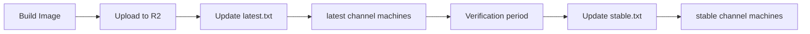

# Release Channels

Shanios publishes releases through two channels: `latest` and `stable`. This page explains the difference and how promotion works.

## Channel Overview

| Channel | Purpose | Update Frequency | Risk |
|---------|---------|-----------------|------|
| `latest` | Newest features and fixes | Every build | Higher — bleeding edge |
| `stable` | Verified, tested releases | After verification period | Lower — production ready |

## How Channels Work

### Pointer Files

Pointer files are per-edition on Cloudflare R2 (`downloads.shani.dev`):

```
https://downloads.shani.dev/<edition>/latest.txt
https://downloads.shani.dev/<edition>/stable.txt
https://downloads.shani.dev/<edition>/iso-latest.txt
https://downloads.shani.dev/<edition>/iso-stable.txt
```

Where `<edition>` is `gnome` or `plasma` (the only two editions with signed ISOs on R2).

Each file contains the date of the current release:

```
20260518
```

When `shani-deploy` checks for updates, it fetches these pointer files and compares them to the currently installed version.

> **Note:** COSMIC, Kiosk, and Server profiles are available as base images (`.zst` send-streams) only — they do not have signed ISOs on R2. See [Cloud Images Beyond AWS](../enterprise/cloud-images.md) for deployment options.

### Promotion Flow

1. A new image is built by `shani-install-media` and uploaded to R2
2. The `<edition>/latest.txt` pointer is updated to the new date
3. Machines on the `latest` channel see the update and can install it
4. After a verification period (no critical bugs reported), the `<edition>/stable.txt` pointer is updated
5. Machines on the `stable` channel then receive the update



Example: fetch current stable ISO date and verify an artifact:

```bash
DATE=$(curl -s https://downloads.shani.dev/gnome/iso-stable.txt)
VER="${DATE:0:4}.${DATE:4:2}.${DATE:6:2}"
curl -sI "https://downloads.shani.dev/gnome/$DATE/signed_shanios-gnome-$VER-x86_64.iso"
```

## Choosing a Channel

- **Developers and early adopters:** Use `latest` to get new features first
- **Production machines and fleet deployments:** Use `stable` for reliability
- **OEM deployments:** Use `stable` — never ship `latest` to end users

## Switching Channels

```bash
# Check current channel
cat /etc/shani-channel

# Switch to stable
sudo shani-deploy --set-channel stable

# Switch to latest
sudo shani-deploy --set-channel latest
```

## See Also

- [System Updates](system) — How shani-update works
- [shani-deploy Reference](https://blog.shani.dev/post/shani-deploy-reference) — Command reference
- [Build Pipeline](../arch/build-pipeline.md) — How images are produced
